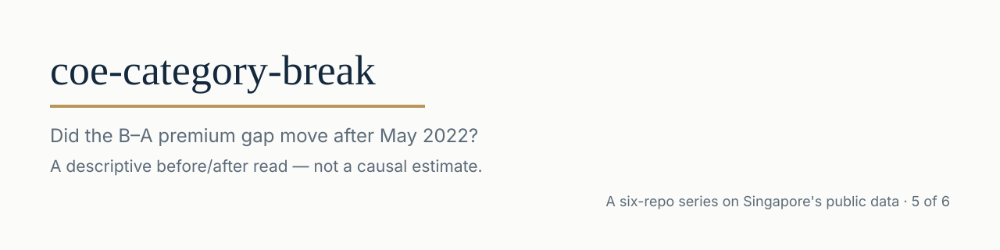
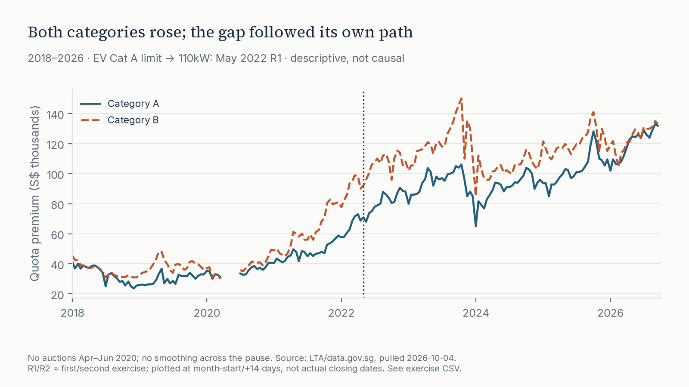
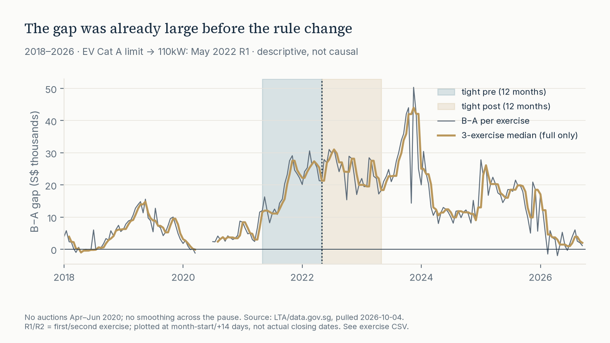

**This is not a causal estimate: redefining Category A/B changed the baskets being compared.**

<picture>
<source media="(prefers-color-scheme: dark)" srcset="assets/banner-dark.svg">

</picture>

[Full-size banner](assets/banner.svg) · [dark](assets/banner-dark.svg)

# coe-category-break

**Muhammad Faiz Saifulnizam** · Singapore data-analytics portfolio

[](https://github.com/faizsaifulnizam/coe-category-break/actions/workflows/ci.yml) [](LICENSE)   [Data: LTA/data.gov.sg](https://data.gov.sg/datasets/d_69b3380ad7e51aff3a7dcc84eba52b8a/view)

> **Both premium levels rose, but the gap answer depends on the window.** The median exercise-level **B−A gap rose from S$6,190.50 to S$18,198.50** in the structural comparison (**+S$12,008**). In the fixed ±12-month comparison it rose only **S$2,336**, from **S$21,745.50 to S$24,081.50**: the gap was already large in the year before May 2022. These describe different samples, **not the effect of the rule change**, and do not establish that the rule had no effect.

**Status:** built and reviewed 2026-10-04; public. Grok-review corrections verified 2026-10-04. Fixed official snapshot through **2026-09 R2**, independently pulled 2026-10-04. Findings/chart titles are reviewed prose, not automatically refreshed text. Part of a six-repo series on Singapore public data. [Report site](https://faizsaifulnizam.github.io/coe-category-break/) · [verification receipts](docs/verification.md). Prior private reviews are archived outside this repository's clean public history.

**Intended use:** For a policy analyst, this brief supports communicating the paired premium gap with both comparison windows and sensitivity checks. It does not assess rule effectiveness, as the categories changed composition and the comparison cannot identify a policy effect.

## Key numbers (all reproducible)

One observation = one fully paired exercise; money is **S$**, not vehicle prices or renewal PQP. All-round rows from [gap_summary.csv](outputs/gap_summary.csv):

| Window / side | Exercises (R1 / R2) | Median A | Median B | Median B−A | Gap min → max |
|---|---:|---:|---:|---:|---:|
| Structural pre: 2018-01–2022-04 | 98 (49 / 49) | 36,619 | 40,005 | 6,190.50 | −1,198 → 30,590 |
| Structural post: 2022-05–2026-09 R2 | 106 (53 / 53) | 96,103 | 115,051.50 | 18,198.50 | −2,009 → 50,335 |
| Tight pre: 2021-05–2022-04 | 24 (12 / 12) | 53,209 | 78,650.50 | 21,745.50 | 8,211 → 30,590 |
| Tight post: 2022-05–2023-04 | 24 (12 / 12) | 86,000 | 108,028.50 | 24,081.50 | 15,355 → 31,104 |

- **Levels rose in both windows:** structural median A **+59,484**, B **+75,046.50**; tight A **+32,791**, B **+29,378**. Do not subtract the level columns to obtain the median paired gap. median(B)−median(A) moves structural 3,386 → 18,948.50 (+15,562.50) but tight 25,441.50 → 22,028.50 (−3,413), the opposite sign from the median paired-gap change (+12,008 structural; +2,336 tight). For the gap finding, quote the median of exercise-level B−A only.
- **Ranges overlap substantially:** post gaps were not uniformly above pre gaps. The long comparison cannot isolate a discontinuity at the event; the tight comparison does not establish its absence.
- Calendar-year median paired gaps (S$), not a permanent post level: 2018 1,991; 2019 8,863.50; 2020 2,852.50; 2021 11,799; 2022 25,890.50 (May split); 2023 23,796.50; 2024 11,900.50; 2025 18,492.50; 2026 2,750 (Jan–Sep R2, 18 exercises). 2022 is not a post-only year. The 2026 partial-year median is below the structural-pre median.
- **Robust reads preserve the sign, not magnitude:** R1-only gap-median changes **+12,398 / +2,792.50** (structural/tight); excluding two exercises each side **+11,892.50 / +2,832.50**. [Sensitivity CSV](outputs/sensitivity.csv) / [how to read it](docs/sensitivity.md).

<picture>
<source media="(prefers-color-scheme: dark)" srcset="reports/figures/f1_levels-dark.png">

</picture>

[Full-size levels](reports/figures/f1_levels.png) · [dark](reports/figures/f1_levels-dark.png)

### More views

<picture>
<source media="(prefers-color-scheme: dark)" srcset="reports/figures/f2_gap-dark.png">

</picture>

[Full-size gap](reports/figures/f2_gap.png) · [dark](reports/figures/f2_gap-dark.png) · [exercise table](outputs/exercise_series.csv). Shading marks comparison windows, **not confidence intervals or treatment effects**. Structural comparison = whole 2018-onward chart on either side.

## The question

After the May 2022 eligibility change, did the A/B premium difference move, or only both levels? Keeping **levels** separate from **B−A** prevents the error that two rising premiums imply a widening gap.

## The data

- [COE Bidding Results / Prices](https://data.gov.sg/datasets/d_69b3380ad7e51aff3a7dcc84eba52b8a/view), **LTA via data.gov.sg**, `d_69b3380ad7e51aff3a7dcc84eba52b8a`. Snapshot: **1,980 rows, 396 exercises, five categories**, 2010-01–2026-09 R2. Analysis: A/B from 2018, 204 paired exercises.
- **Boundary: May 2022 first exercise, 4–6 May**, not the March announcement. [LTA circular VRL/04/2022, pp 1, 4–5](https://onemotoring.lta.gov.sg/content/dam/onemotoring/pdf/Circulars%20to%20ESAs/2022/VRL_04_2022.pdf) raises fully electric Category A maximum-power threshold **97 → 110kW inclusive**. Non-fully-electric A limits remain **≤1,600cc AND ≤97kW**; fully electric cars above 110kW enter B. This changes eligibility/composition, not just a label on a fixed basket. Earlier COEs and taxis have separate rules in the circular.
- **Month + bidding number** identifies an exercise, not its closing date. Charts place R1 at month-start and R2 fourteen days later for spacing only.
- **Premium = auction quota premium**, not renewal Prevailing Quota Premium or average vehicle transaction price.
- Small licensed raw CSV + byte-SHA-256 [manifest](data/raw/pull_manifest.json) vendored for offline reproduction; independent acquisition, no cross-repo runtime dependency. [Raw notes](data/raw/README.md) / [audit](docs/data_audit.md).
- Same source as [coe-quota-premium](https://github.com/faizsaifulnizam/coe-quota-premium), different question. Public archives, Kaggle copies and press gap commentary exist: no new-data or first-ever-analysis claim.

## Method

1. **Acquire/verify bytes** — [download.py](src/download.py): official initiate → poll → signed URL; validation before raw+manifest replacement. Default validates the vendored cache; `--force` refreshes explicitly.
2. **Stage/check** — [01_staging.sql](sql/01_staging.sql) uses `TRY_CAST` for comma-formatted integers; [05_checks.sql](sql/05_checks.sql) checks nonnull values, unique keys, five-category coverage, positive premiums/quotas and A/B pairing before [build_dataset.py](src/build_dataset.py) publishes parquet.
3. **Measure** — [02_metrics.sql](sql/02_metrics.sql) pairs A/B, computes `gap = premium_B − premium_A`, windows and full rolling medians. [analysis.py](src/analysis.py) exports three CSVs from checked raw-backed SQL tables. Parquet is an inspectable staging artifact.
4. **Stress-test** — both declared windows, R1-only and excluding two all-round exercises each side. [Independent raw-CSV calculations](tests/test_analysis.py) reproduce every summary median, minimum, maximum and count using stdlib `statistics`, not DuckDB.
5. **Communicate** — [figures.py](src/figures.py) generates both themes and banners after pixel QA, including identical Pages copies in the same validated batch. [Memo](docs/decision_memo.md) / [experiment annex](docs/if_i_ran_the_test.md).

### Rules chosen, and why

Windows/filters were declared before numerical interpretation in the build sheet; neither was chosen for the result.

| Rule | Choice and reason |
|---|---|
| Structural | 2018-01 R1–2022-04 R2 vs 2022-05 R1–latest fully paired exercise. Long-run context, not equal-duration or seasonally matched samples; different market cycles included. |
| Tight | 2021-05 R1–2022-04 R2 vs 2022-05 R1–2023-04 R2: calendar ±12 months. Every month appears once per side; this does not remove trends or anticipation. |
| Weight/rounds | Each genuine exercise once, not quota/bid/registration-weighted. Both rounds treated identically across the boundary. |
| Pairing/latest | Reject missing A/B, duplicates, partial category coverage or missing scheduled auctions. A latest R1 with all categories is a complete **exercise**, not necessarily a complete month. Partial latest exercise is rejected. |
| Suspension | Six scheduled Apr–Jun 2020 exercises did not occur ([LTA](https://www.lta.gov.sg/content/ltagov/en/newsroom/2020/6/news-releases/resumption-of-coe-bidding-exercises-from-6-july.html)). Absent, not zero-price observations; no imputation. |
| Smoothing | Trailing **three exercises**, not three months: `ROWS 2 PRECEDING` plus three-row AND consecutive-scheduled-slot guards. Null at left edge and first two auctions after suspension; charts do not bridge the pause. Comparison windows remain calendar-based. |
| Transition | Exclude Apr-2022 R1/R2 and May-2022 R1/R2: last two pre, first two post. Selection uses all-round order before any R1 filter. |
| Medians/ranges | Median of **paired differences**, not subtraction of category medians. Min/max are observed variation, not uncertainty bounds. No trimming/significance test. |

### Validation — receipts, not claims

- Raw: **78,695 bytes**, SHA-256 `361d5ae2ba641be1e834ca822e4cb66a91f42b6f7663847f42fcc4a4062b4bac`; default download checks integrity/schema/scheduled coverage.
- Reconciliation: **1,980 = 960 pre-2018 + 612 C/D/E in 2018+ + 408 A/B retained rows**. Zero suspension rows in this snapshot; 408 rows pair into **204** exercises. [Audit](docs/data_audit.md).
- Independent stdlib checks cover **12 summary rows**. Regression fixtures cover missing/unpaired A/B, duplicate keys, partial latest, complete latest R1, future growth, transition selection and smoothing reset.
- Schema, malformed-quote and out-of-range-integer HTTP downloads leave prior raw and manifest bytes intact. Strict CSV parsing and signed BIGINT bounds apply before publication; SQL checks every staged numeric field for NULL. Valid imported and direct-script refresh paths use the same publication helper. Each producer validates its batch, stages files, atomically replaces each target and rolls back ordinary replacement exceptions. **Single writer; not whole-pipeline or crash/power-loss atomic.**
- Figures: measured ≥40px title/subtitle/footer horizontal margins; text bounds/overlap and legend-observation clearance. Two renders hash-match four PNGs and two SVGs **in one environment**. SVG font fallback across viewers and cross-OS PNG identity are not established.
- CI: Python 3.12, hash-locked dependencies, full vendored pipeline (no data-fetch network), regressions/repeated hashes, locked snapshot headlines and committed-CSV diff. Installing dependencies needs network/cache; badge is not causal or visual certification.

### Limits

**No untreated market or fixed-composition control.** B is not untreated: electric cars can switch categories in a shared scarce-permit market. B−A cancels only exactly shared additive changes, not category-specific quota, demand or mix changes. March announcement permits anticipation in nominal pre. Range overlap or a small tight-window median change cannot prove zero policy effect.

### Principles this repo follows

One locked question; declared windows; SQL first; preserve bytes; independent checks; limits beside findings. **Hermes-assisted portfolio work:** Hermes implemented pipeline/presentation; Faiz chose the question and approved publication after review. No unaided-coding claim.

## Reproduce

Requires uv on PATH (https://docs.astral.sh/uv/) to create the Python 3.12 venv. If uv is absent, use `python3.12 -m venv .venv` (`py -3.12 -m venv .venv` on Windows), activate as below, then use the same pip line. CI uses actions/setup-python and does not run the uv line.

```bash
git clone https://github.com/faizsaifulnizam/coe-category-break && cd coe-category-break
uv venv .venv --python 3.12 --seed
# bash / Git Bash activation, Windows or Linux:
if [ -f .venv/Scripts/activate ]; then source .venv/Scripts/activate; else source .venv/bin/activate; fi
python -m pip install --require-hashes -r requirements.lock

python src/download.py       # validate vendored snapshot, no live data-fetch network
python src/build_dataset.py  # staging + SQL checks → inspectable parquet
python src/analysis.py       # three committed CSVs
python src/figures.py        # four PNGs + two SVGs + Pages copies, validated batch
python -m unittest discover -s tests -v
python tests/smoke_test.py
```

Figure PNG bytes are not a cross-machine lock. A dirty `reports/figures` or `docs/img` after `figures.py` is compression/metadata-only only if the decoded pixels also match the committed PNGs. An empty CSV diff alone does not establish image equivalence; inspect any pixel differences.

Spot-check `gap_summary.csv`, `variant=all`: structural **6,190.50 → 18,198.50**, tight **21,745.50 → 24,081.50**; then `git diff --exit-code -- 'outputs/*.csv'`. A later `python src/download.py --force` creates a **new snapshot**: rerun and review maintained prose/chart titles and locks before publishing. Fixed tight-window dates do not slide with new history.

## Caveats

At the boundary, summed exercise quota in this snapshot moves Feb–Apr 2022 → May–Jul 2022 by Cat A 3,220 → 3,708 (+15.2%) and Cat B 3,325 → 3,168 (−4.7%); Apr R2 → May R1 is A 532 → 612 (+15.0%) and B 560 → 527 (−5.9%). This is a category-asymmetric supply change in the same file, not a control, and it is not removed by B−A. These figures come from the vendored quota column, not a separately verified release annex.

Quota/supply cycles, dealer orders/bidding strategy, model availability, EV incentives/adoption, macro conditions and anticipation are potential confounds. Reclassification may move measured gaps mechanically through basket composition without proving a behavioral response. Aggregate clearing prices lack individual bids, EV power bands, registrations or buyer substitution. Structural validation does not certify every historical cell; the as-is source can revise.

## Out of scope

Causal estimates, difference-in-differences, significance stars, policy prescriptions, forecasts, price prediction. The annex is a feasibility-limited design discussion, not an experiment implemented with this dataset.

## Licence

Code: [MIT](LICENSE). Data: © Land Transport Authority via data.gov.sg, [Singapore Open Data Licence](https://data.gov.sg/open-data-licence). Attribution covers vendored snapshot and derivatives. Independent, unofficial; no LTA endorsement.

---

*Six-on-SG: six Singapore-data analyses plus one AI workflow — seven repos: [hdb-resale-mart](https://github.com/faizsaifulnizam/hdb-resale-mart) · [card-book-quality](https://github.com/faizsaifulnizam/card-book-quality) · [coe-quota-premium](https://github.com/faizsaifulnizam/coe-quota-premium) · [retail-sales-split](https://github.com/faizsaifulnizam/retail-sales-split) · [coe-category-break](https://github.com/faizsaifulnizam/coe-category-break) · [hdb-lease-slope](https://github.com/faizsaifulnizam/hdb-lease-slope) · [ai-analyst-workflow](https://github.com/faizsaifulnizam/ai-analyst-workflow) (the AI-workflow add).*

*If you found this useful, a star helps others find it.*